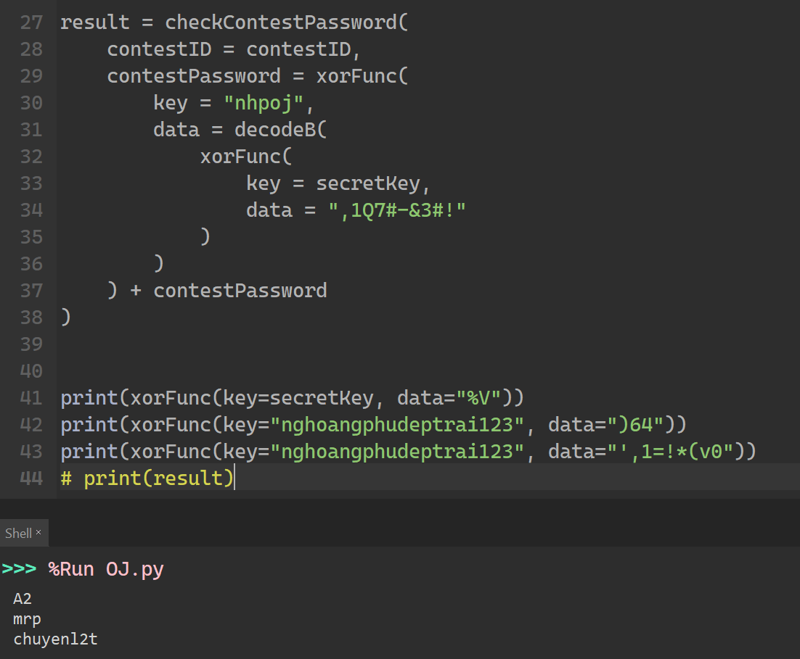
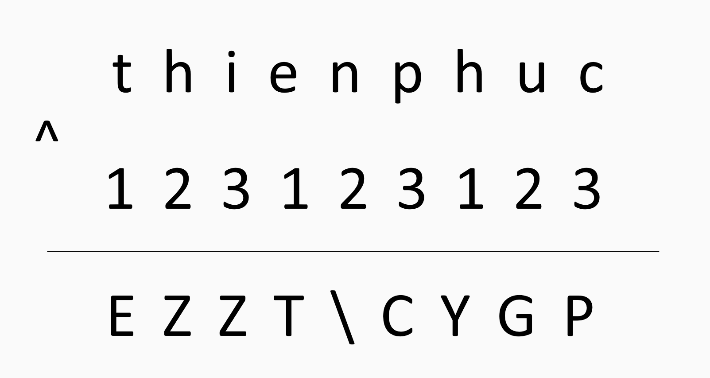
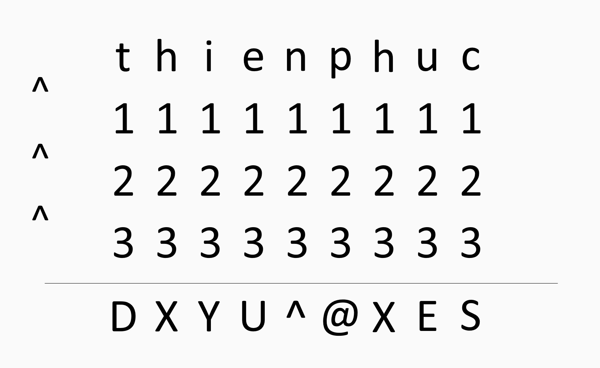

Sau một thời gian dài làm bài tập lẫn kiểm tra trên [SEB](https://safeexambrowser.org/download_en.html) (Safe Exam Browser) của <a style="color: #fc2314" href="https://nhpoj.net/user-home?username=nhphu87">Mr. P</a>, <a style="color: #fc2fb1" href="https://nhpoj.net/user-home?username=thienphuc3005">Thiên Phúc</a> bắt đầu cảm thấy quá mệt mỏi vì giao diện của nó đã tệ, nay lại còn tệ hơn với quả combo Light Theme quá loá mắt với một người xài Macbook màn xịn như bạn cộng thêm cái [IDE](https://nhpoj.net/ide) cực phế không highlight, không suggest mà lâu lâu lại tự xuống dòng ngẫu nhiên một cách đáng ghét. Đã vậy lại còn có quảng cáo nữa chứ (không biết <a style="color: #fc2314" href="https://nhpoj.net/user-home?username=nhphu87">Mr. P</a> trong tương lai có định thêm tính năng **premium** vào web của mình không).

Quá bực bội, nhưng <a style="color: #fc2fb1" href="https://nhpoj.net/user-home?username=thienphuc3005">Thiên Phúc</a> cũng chả biết làm gì, thôi thì đành phải chịu thua trước sự độc ác của <a style="color: #fc2314" href="https://nhpoj.net/user-home?username=nhphu87">Mr. P</a>, bạn lại cứ tiếp tục những năm tháng khổ nhọc của mình với cái trình duyệt đáng ghét, cứ lên đó làm bài, chửi vài câu rồi lại thoát ra. Ngày qua ngày, mọi thứ vẫn lặp đi, lặp lại nhàm chán như thế.

Cho đến một hôm đẹp trời, một hôm đánh dấu sự trưởng thành trong tâm trí của <a style="color: #fc2fb1" href="https://nhpoj.net/user-home?username=thienphuc3005">Thiên Phúc</a>, cái hôm mà bạn quyết định vùng lên dành độc lập, tự do, hạnh phúc cho riêng mình. Đúng. <a style="color: #fc2fb1" href="https://nhpoj.net/user-home?username=thienphuc3005">Thiên Phúc</a> sẽ nổi dậy chống lại <a style="color: #fc2314" href="https://nhpoj.net/user-home?username=nhphu87">Mr. P</a>, chống lại sự áp bức mà bấy lâu nay <a style="color: #fc2314" href="https://nhpoj.net/user-home?username=nhphu87">Mr. P</a> đã "dịu dàng" dành cho bạn. <a style="color: #fc2fb1" href="https://nhpoj.net/user-home?username=thienphuc3005">Thiên Phúc</a> nhớ lại những năm tháng hào hùng, những trang sử vẻ vang của ông cha ta về sự bất khuất, kiên cường chống lại ách thống trị của thực dân Pháp, Mĩ. Bạn nhớ lại hình ảnh của Phương Định phá bom, của ông Hai với cái làng Chợ Dầu, hình ảnh những người đồng chí kề vai sát cánh với nhau chờ địch dưới đêm trăng, và đặc biệt không thể quên tình thương thắm thiết của anh Sáu dành cho bé Thu giống như tình thương của <a style="color: #fc2314" href="https://nhpoj.net/user-home?username=nhphu87">Mr. P</a> đã **từng** dành cho <a style="color: #fc2fb1" href="https://nhpoj.net/user-home?username=thienphuc3005">Thiên Phúc</a> vậy.

Mọi khoảnh khắc ấy dường như đã tiếp thêm động lực cho <a style="color: #fc2fb1" href="https://nhpoj.net/user-home?username=thienphuc3005">Thiên Phúc</a>, giúp bạn có niềm tin và hi vọng để thực hiện khát khao to lớn của mình. Và thế là <a style="color: #fc2fb1" href="https://nhpoj.net/user-home?username=thienphuc3005">Thiên Phúc</a> đã bắt tay vào việc.

Vốn dĩ là một người rất thông minh, <a style="color: #fc2fb1" href="https://nhpoj.net/user-home?username=thienphuc3005">Thiên Phúc</a> nhận ra ngay giao diện quen thuộc của <a href="https://nhpoj.net" style="color: #6a5acd">nhpoj.net</a> trên [SEB](https://safeexambrowser.org/download_en.html) đã bị <a style="color: #fc2314" href="https://nhpoj.net/user-home?username=nhphu87">Mr. P</a> lượt bỏ "kha khá" phần, và cũng nhờ đó <a style="color: #fc2fb1" href="https://nhpoj.net/user-home?username=thienphuc3005">Thiên Phúc</a> mới phát hiện ra là <a style="color: #fc2314" href="https://nhpoj.net/user-home?username=nhphu87">Mr. P</a> dùng hai loại [frontend](https://github.com/Harry-zklcdc/OJ) khác nhau cho mục đích của mình. Một cái cho <a href="https://nhpoj.net" style="color: #6a5acd">nhpoj.net</a> và một cái cho [SEB](https://safeexambrowser.org/download_en.html).

Khi xem mục [contest](https://nhpoj.net/contest) trên <a href="https://nhpoj.net" style="color: #6a5acd">nhpoj.net</a>, <a style="color: #fc2fb1" href="https://nhpoj.net/user-home?username=thienphuc3005">Thiên Phúc</a> vẫn thấy có kỳ thi của mình, có điều nhập mật khẩu trên web thì sai mà trên [SEB](https://safeexambrowser.org/download_en.html) lại đúng. <a style="color: #fc2fb1" href="https://nhpoj.net/user-home?username=thienphuc3005">Thiên Phúc</a> nghĩ ắt hẳn phải có mối liên hệ gì giữa những thứ này, nhưng thôi kệ, bạn lại tiếp tục công cuộc nghiên cứu của mình. Sau một hồi mày mò, <a style="color: #fc2fb1" href="https://nhpoj.net/user-home?username=thienphuc3005">Thiên Phúc</a> hiện đang có hai ý tưởng:

- Một là chỉnh sửa file `.seb` mà <a style="color: #fc2314" href="https://nhpoj.net/user-home?username=nhphu87">Mr. P</a> cấp cho. 

- Hai là biên dịch [SEB](https://safeexambrowser.org/download_en.html) từ nguồn sau khi đã bỏ đi những thứ vớ vẩn. 

Thế là <a style="color: #fc2fb1" href="https://nhpoj.net/user-home?username=thienphuc3005">Thiên Phúc</a> bác bỏ hết cả hai ý tưởng. Không phải vì bạn thể không thực hiện được mà là vì cả hai cách ấy đều quá tốn công tốn sức đối với một người lười biếng như <a style="color: #fc2fb1" href="https://nhpoj.net/user-home?username=thienphuc3005">Thiên Phúc</a>. Nếu muốn, bạn có thể thực hiện nó dễ dàng nhưng <a style="color: #fc2fb1" href="https://nhpoj.net/user-home?username=thienphuc3005">Thiên Phúc</a> lại muốn một cách nào đó nhanh gọn hơn.

Nhắc tới sự nhanh gọn, <a style="color: #fc2fb1" href="https://nhpoj.net/user-home?username=thienphuc3005">Thiên Phúc</a> lại nhớ đến <a style="color: #fc2314" href="https://nhpoj.net/user-home?username=nhphu87">Mr. P</a> với cái cách mà <a style="color: #fc2314" href="https://nhpoj.net/user-home?username=nhphu87">Mr. P</a> nhập mật khẩu [SEB](https://safeexambrowser.org/download_en.html) được ngay trên <a href="https://nhpoj.net" style="color: #6a5acd">nhpoj.net</a>. Và việc này dẫn bạn đến câu hỏi ban đầu của mình:

  
> Tại sao nhập mật khẩu trên web thì sai mà trên [SEB](https://safeexambrowser.org/download_en.html) lại đúng?

  

Sau một hồi cân nhắc, tư duy logic nát cả óc, <a style="color: #fc2fb1" href="https://nhpoj.net/user-home?username=thienphuc3005">Thiên Phúc</a> cũng đã có thể liệt kê ra những khả năng. Nhưng khi xét về độ lười biếng thì <a style="color: #fc2314" href="https://nhpoj.net/user-home?username=nhphu87">Mr. P</a> cũng chả thua kém gì mình nên <a style="color: #fc2fb1" href="https://nhpoj.net/user-home?username=thienphuc3005">Thiên Phúc</a> đã có thể giới hạn những khả năng sau thành một. Đó chính là <a style="color: #fc2314" href="https://nhpoj.net/user-home?username=nhphu87">Mr. P</a> đã làm gì đó với cái [frontend](https://github.com/Harry-zklcdc/OJ) dùng trên [SEB](https://safeexambrowser.org/download_en.html). Cụ thể hơn là có khả năng <a style="color: #fc2314" href="https://nhpoj.net/user-home?username=nhphu87">Mr. P</a> đã thêm một chuỗi kí tự bí mật nào đó vào đầu hay cuối chuỗi mật khẩu ban đầu.

Nhiệm vụ của <a style="color: #fc2fb1" href="https://nhpoj.net/user-home?username=thienphuc3005">Thiên Phúc</a> bây giờ là tìm chuỗi kí tự bí mật đó để có thể vào những contest cần phải dùng SEB ngay trên web thường. Và nhờ vào trí óc siêu phàm của mình, bạn đã nhớ ra được một chi tiết rất quan trọng, là chìa khoá để giúp bạn giải quyết được vấn đề này. Đó là lúc học online, <a style="color: #fc2314" href="https://nhpoj.net/user-home?username=nhphu87">Mr. P</a> đã "vô tình" để lộ một đoạn code không rõ trong khi đang chia sẻ màn hình, và <a style="color: #fc2fb1" href="https://nhpoj.net/user-home?username=thienphuc3005">Thiên Phúc</a> đã cap màn ngay như một bản năng. Đoạn code đó là:

  
    
  

Như các bạn đã thấy, đoạn code mà <a style="color: #fc2fb1" href="https://nhpoj.net/user-home?username=thienphuc3005">Thiên Phúc</a> đã cap là màn hình của <a style="color: #fc2314" href="https://nhpoj.net/user-home?username=nhphu87">Mr. P</a> đang sửa code trên web của mình (có lẽ là đang test code mới dùng lệnh `print()` đây). Mà bỏ chuyện đó qua một bên, <a style="color: #fc2fb1" href="https://nhpoj.net/user-home?username=thienphuc3005">Thiên Phúc</a> để ý ở phía phần console của cửa sổ là output của của ba dòng **41**, **42** và **43** (tiếc là dòng **44** đã bị <a style="color: #fc2314" href="https://nhpoj.net/user-home?username=nhphu87">Mr. P</a> comment đi mất). <a style="color: #fc2fb1" href="https://nhpoj.net/user-home?username=thienphuc3005">Thiên Phúc</a> nhanh chóng lập ra kế hoạch cho mình. Nhưng trước hết <a style="color: #fc2fb1" href="https://nhpoj.net/user-home?username=thienphuc3005">Thiên Phúc</a> phải biết cách tự triển khai hàm ``xorFunc()`` giống như <a style="color: #fc2314" href="https://nhpoj.net/user-home?username=nhphu87">Mr. P</a>. Nhưng vì đã có kinh nghiệm về **XOR** và các thứ liên quan nhờ vào việc trích xuất các file tài nguyên của một game nào đó được mã hoá bằng **XOR**, giờ đây <a style="color: #fc2fb1" href="https://nhpoj.net/user-home?username=thienphuc3005">Thiên Phúc</a> đã có thể dễ dàng hiểu được cách <a style="color: #fc2314" href="https://nhpoj.net/user-home?username=nhphu87">Mr. P</a> triển khai hàm ``xorFunc()`` được miêu tả như sau:

- Hàm ``xorFunc()`` lấy vào hai tham số: `key` và `data`. Cả hai tham số đều ở kiểu dữ liệu chuỗi.

- Các tính chất của phép **XOR** ($⊕$) là:
    - $A ⊕ A = 0$
    - $A ⊕ 0 = A$
    - $(A ⊕ B) ⊕ C =  A ⊕ (B ⊕ C)$
  

- Vì phép **XOR** chỉ có thể thực hiện trên các số nguyên nên nếu muốn thực hiện phép **XOR** giữa hai ký tự người ta thường sử dụng thứ tự trong [bảng mã ASCII](https://vi.wikipedia.org/wiki/ASCII) của chúng **XOR** với nhau rồi chuyển đổi trở lại.

- Đúng như tên gọi của nó, về lý thuyết hàm ``xorFunc()`` của <a style="color: #fc2314" href="https://nhpoj.net/user-home?username=nhphu87">Mr. P</a> sẽ thực hiện phép **XOR** giữa từng kí tự trong tham số `data` và kí tự ở vị trí tương ứng với nó trong tham số `key`. Khi đã **XOR** hết độ dài của chuỗi `key` mà vẫn chưa hết độ dài chỗi `data`, ta sẽ bắt đầu **XOR** tiếp lại từ vị trí ban đầu của chuỗi `key`.

    Ví dụ nếu ta đưa vào tham số `key` chuỗi `123` và đưa vào tham số `data` chuỗi `thienphuc` thì hàm ``xorFunc()`` sẽ làm việc như sau:

  

  

- Đó là trên lý thuyết, còn thực tế <a style="color: #fc2314" href="https://nhpoj.net/user-home?username=nhphu87">Mr. P</a> lại triển khai nó theo một cách khác không giống ai (chắc vì <a style="color: #fc2314" href="https://nhpoj.net/user-home?username=nhphu87">Mr. P</a> nghĩ làm thế sẽ bảo mật hơn nhưng...). Thay vì làm như cách trên, <a style="color: #fc2314" href="https://nhpoj.net/user-home?username=nhphu87">Mr. P</a> lại thực hiện phép **XOR** giữa từng kí tự trong tham số `data` lần lượt với hết tất cả kí tự trong tham số `key` như hình dưới:

  

  

Vốn biết <a style="color: #95ed23" href="https://nhpoj.net/user-home?username=monke">Lê Khôi</a> là một bật thầy trong việc tà đạo, là chuyên gia cop code trên mạng về nên <a style="color: #fc2fb1" href="https://nhpoj.net/user-home?username=thienphuc3005">Thiên Phúc</a> định cho <a style="color: #95ed23" href="https://nhpoj.net/user-home?username=monke">Lê Khôi</a> *"cook"* cái hàm này của <a style="color: #fc2314" href="https://nhpoj.net/user-home?username=nhphu87">Mr. P</a> thay cho mình. Yêu cầu cho <a style="color: #95ed23" href="https://nhpoj.net/user-home?username=monke">Lê Khôi</a> là viết chương trình tìm ra tham số `key` của hàm ``xorFunc()`` khi biết được đầu ra của hàm kèm với tham số `data` của nó. Rồi sau đó dùng tham số `key` vừa mới tìm được để giải mã những chuỗi kí tự khác được cho.

  

Ví dụ có ngay trong ảnh chụp màn hình của <a style="color: #fc2fb1" href="https://nhpoj.net/user-home?username=thienphuc3005">Thiên Phúc</a>:

- Ở dòng số **42**, ta có tham số `data` là `)64` cùng với giá trị trả về của hàm `xorFunc()` là `mrp`. Vì vậy giá trị tham số `key` chúng ta cần tìm là `nghoangphudeptrai123`. Lưu ý có thể có nhiều giá trị `key` hợp lệ và mỗi giá trị này không nhất thiết phải là ký tự in được. Ví dụ thay vì `nghoangphudeptrai123` ta có thể thay thế bằng `hoangphuvipproD` vẫn sẽ cho ra kết quả đúng.

  

> <b style="color: red">YÊU CẦU: </b> Hãy giúp <a style="color: #95ed23" href="https://nhpoj.net/user-home?username=monke">Lê Khôi</a> viết chương trình tìm ra tham số `key` khi có được tham số `data` và đầu ra `output` của hàm ``xorFunc()``. Sau đó triển khai lại hàm ``xorFunc()`` giống <a style="color: #fc2314" href="https://nhpoj.net/user-home?username=nhphu87">Mr. P</a> với tham số `key` vừa tìm được để trả lời $Q$ truy vấn, mỗi truy vấn là một chuỗi kí tự được cho trong dữ liệu đầu vào sẽ được dùng dưới dạng tham số `data` của hàm ``xorFunc()``. In ra mỗi dòng từng kết quả của các truy vấn trên.

  
  